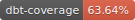

---

# Billiam's Database 🧙‍♂️

As part of my life admin, I keep track of:

- Every transaction I make at an item level (since 2018-01-18)
- On the job, what I'm working on every 15 minutes (since 2019-04-23)

Note that the latter job tracker is what the repo [daily-tracker](https://github.com/Bilbottom/daily-tracker) is for

This repo is both a [dbt](https://www.getdbt.com/) POC plus a means for me to analyse my spending and work

Current lineage diagram:

Documentation is hosted at:

- https://bilbottom.github.io/billiam-database
